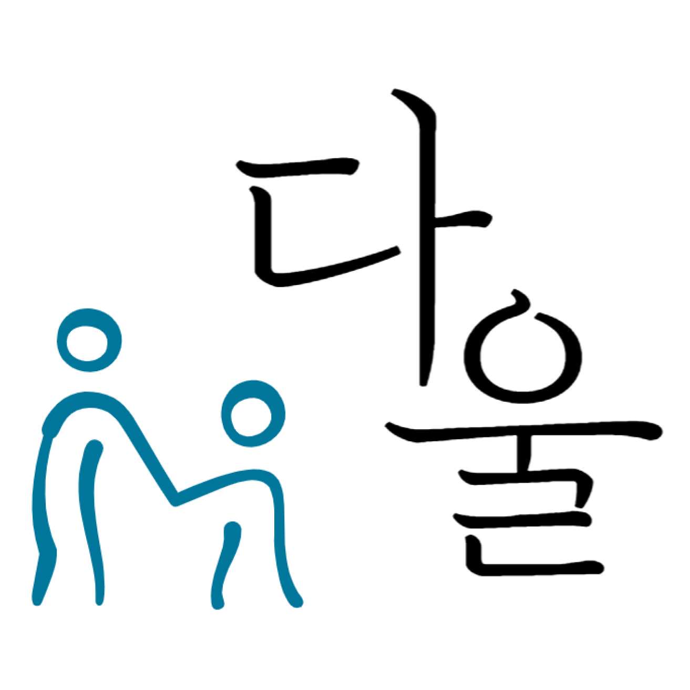

# 🧳 다울



## == Contents ==

1. [개요](#개요)
2. [프로젝트 소개](#프로젝트-소개)
3. [주요기능](#주요-기능)
4. [프로젝트 실행방법](#프로젝트-실행-방법)
5. [기술스택](#🔧-기술-스택)
   1. [Front-End](#front-end)
   2. [Back-End](#back-end)
6. [프로젝트 구조도](#프로젝트-구조도)
7. [Design](#design)
8. [TEAM](#team)

<br><br>

## 개요

> 개발 기간: 2023.03.20 ~ 2023.04.07

<br><br>

## 프로젝트 소개


무장애 여행지 추천 서비스
(설명 더 쓰면 좋을듯..)

<br><br>

## 주요 기능

### 1. 무장애 필터링


- 지체장애, 시각장애, 청각장애, 노인, 영유아로 필터링하여 사용자 맞춤형 여행지 확인 가능

<br>

### 2. STT / TTS


- 검색창 뿐만 아니라 음성으로도 검색이 가능
- 상세 페이지에서 TTS 기능을 통해 여행지의 상세 정보를 음성으로 들을 수 있음

<br>

### 3. 여행지 추천


- 취향 설문과 최근 본 여행지를 기반으로 사용자 맞춤형 여행지를 추천
- 취향 설문은 5개의 질문으로 구성되어 있음

<br><br>

## 프로젝트 실행 방법


<br><br>

## 🔧 기술 스택

### Front-End


### Back-End

#### API 서버


#### 추천 시스템 서버


#### DB


### Deployment


### Communication


<br><br>

## 프로젝트 구조도

```
└─📂backend
    └─📁 api-server
    └─📁 django
└─📂frontend
```

### Front-End

### Back-End

```
└─📂 src
    ├─📂 main
    │  ├─📂 java
    │  │  └─📂 com
    │  │      └─📂 dawool
    │  │          └─📂 api
    │  │              ├─📁 code
    │  │              ├─📁 config
    │  │              ├─📁 controller
    │  │              ├─📂 dto
    │  │              │  ├─📁 detailInfo
    │  │              │  └─📁 user
    │  │              ├─📁 entity
    │  │              ├─📁 error
    │  │              ├─📁 jwt
    │  │              ├─📁 repository
    │  │              └─📁 service
    │  └─📂 resources
    │      ├─📁 static
    │      └─📁 templates
└─🐘 build.gradle
└─🐘 settings.gradle
```

<br><br>

## Design
### 시스템 구조도


<br>

### API 설계


<br><br>

## TEAM
### Front-end
<table class="tg">
<thead>
  <tr>
    <th class="tg-0pky">팀원</th>
    <th class="tg-0pky">최예린</th>
    <th class="tg-0pky">이해솜</th>
    <th class="tg-0pky">이지예</th>
  </tr>
</thead>
<tbody>
  <tr>
    <td class="tg-0pky">GitHub</td>
    <td class="tg-0pky">-</td>
    <td class="tg-0pky">-</td>
    <td class="tg-0pky">-</td>
  </tr>
  <tr>
    <td class="tg-0pky">역할 및 담당 기능</td>
    <td class="tg-0pky">
    - 팀장<br>
    - 디자인<br>
    - 취향설문<br>
    - 추천 및 여행지 목록</td>
    <td class="tg-0pky">
    - FE 팀장<br>
    - 컴포넌트 구조 설계<br>
    - 검색<br>
    - 필터링</td>
    <td class="tg-0pky">
    - 회원관리<br>
    - 장소관리<br>
    - API</td>
  </tr>
</tbody>
</table>

<br>

### Back-end

<table>
<thead>
  <tr>
    <th class="tg-0pky">팀원</th>
    <th class="tg-0pky">김정은</th>
    <th class="tg-0pky">박희주</th>
    <th class="tg-0pky">이 준</th>
  </tr>
</thead>
<tbody>
  <tr>
    <td class="tg-0pky">GitHub</td>
    <td class="tg-0pky">-</td>
    <td class="tg-0pky">-</td>
    <td class="tg-0pky">-</td>
  </tr>
  <tr>
    <td class="tg-0pky">역할 및 담당 기능</td>
    <td class="tg-0pky">
    - BE 팀장<br>
    - CI/CD<br>
    - 장소관리</td>
    <td class="tg-0pky">
    - 추천 알고리즘<br>
    - API</td>
    <td class="tg-0pky">
    - 회원관리<br>
    - 검색</td>
  </tr>
</tbody>
</table>

<br><br>

## 📒 License

<p>
This software is licensed under the MIT <a href="https://www.ssafy.com/ksp/jsp/swp/swpMain.jsp" _blank="new">©SSAFY</a>.
</p>